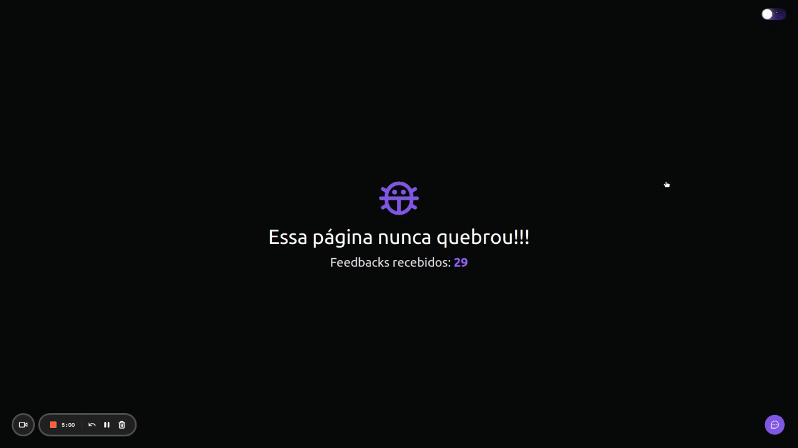

<h1 align="center">Feedget</h1>

  

## How it works

<h1 align="center">
    
</h1>

 

## 💻 Project

Feedget is a widget that helps you get feedback for your app, website or platform.

This project is separated into two applications, the frontend (web) and the backend (server).

For more information click on [web](web/README.md) or [server](server/README.md).

---

Made with 💜 by Caio 👋🏻
