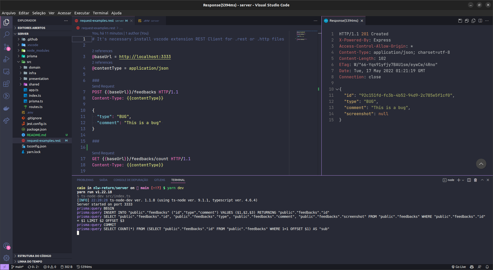

<h1 align="center">Feedget Server</h1>

  

  

## ✨ Technologies

This project was developed with the following technologies:

- [Node.js](https://nodejs.org/en/)
- [Typescript](https://www.typescriptlang.org/)
- [Express](https://expressjs.com/)
- [Prisma](https://www.prisma.io/)
- [Jest](https://jestjs.io/)
- [Websockets](https://socket.io/)

## 💻 Project

Feedget is a widget that helps you get feedback for your app, website or platform.

## 🚀 How to run

- Clone the repository
- Run `yarn` to install dependencies
- Run `yarn prisma migrate dev` to create the database tables.
- Run `yarn dev` to start the application.

---
Made with 💜 &nbsp;by Caio 👋🏻 &nbsp;
