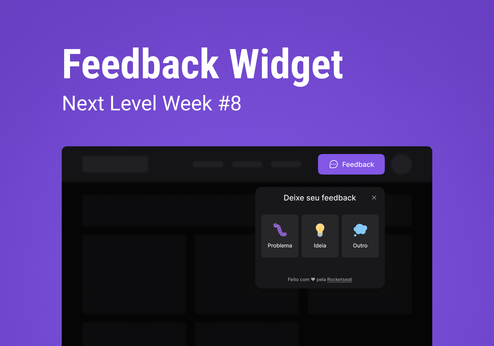

<h1 align="center">Feedget Web</h1>

  

<h1 align="center">
    
</h1>

 

## ✨ Technologies

This project was developed with the following technologies:

- [Vite](https://vitejs.dev/)
- [React](https://reactjs.org)
- [TypeScript](https://www.typescriptlang.org/)
- [Tailwind](https://tailwindcss.com/)
- [Phospor](https://phosphoricons.com/)
- [Websockets](https://socket.io/)

## 🚀 How to run

- Clone the repository
- Run `yarn` to install dependencies
- Run `yarn dev` to start the application.

## 💻 Project

Feedget is a widget that helps you get feedback for your app, website or platform.

## 🔖 Layout

You can view the layout of the project via the link below:

- [Layout Web](https://www.figma.com/community/file/1102912516166573468/Feedback-Widget) 

Remembering that you need to have an account on [Figma](http://figma.com/).

---

Made with 💜 by Caio 👋🏻
